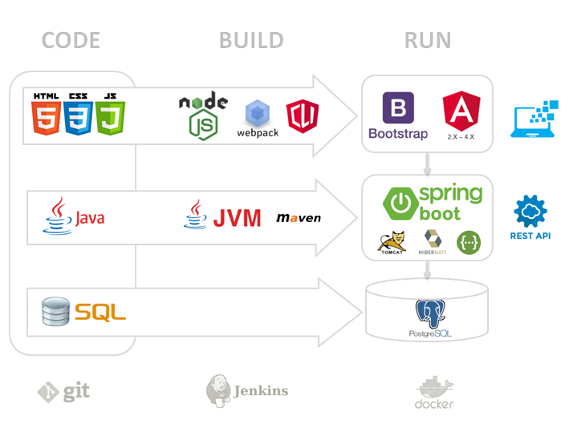

springboot1-angular5-bootstrap4-starter
===

## Customization (optional, remove this part later)

Rename java packages 'com.damienfremont.starter' to 'com.<YOUR COMPANY>.<YOUR DOMAIN>'

Replace all text instances of :
- 'com.damienfremont.starter' by 'com.<YOUR COMPANY>.<YOUR DOMAIN>'
- 'springboot1-angular5-bootstrap4-starter' by '<YOUR APP>'
- 'starter-' by '<YOUR APP>-'

## Development

Before you can build this project, you must install and configure the following dependencies on your machine:

1. [Node.js][]: We use Node to run a development web server and build the project.
   Depending on your system, you can install Node either from source or as a pre-packaged bundle.
2. [Maven][]: We use Maven to manage Java dependencies.

After installing Node, you should be able to run the following command to install development tools.
You will only need to run this command when dependencies change in [package.json](package.json).

    npm install

We use angular-cli and [Webpack][] as our build system.

Run the following commands in two separate terminals to create a blissful development experience where your browser
auto-refreshes when files change on your hard drive.

    ./mvnw
    npm start

[Npm][] is also used to manage CSS and JavaScript dependencies used in this application. You can upgrade dependencies by specifying a newer version in [package.json](package.json).

### Using angular-cli

You can also use [Angular CLI][] to generate some custom client code.

For example, the following command:

    ng generate component my-component

will generate few files:

    create src/main/webapp/app/my-component/my-component.component.html
    create src/main/webapp/app/my-component/my-component.component.ts
    update src/main/webapp/app/app.module.ts

## Building for production

To optimize the springboot1-angular5-bootstrap4-starter application for production, run:

    ./mvnw -Pprod clean package

This will concatenate and minify the client CSS and JavaScript files. It will also modify `index.html` so it references these new files.
To ensure everything worked, run:

    java -jar target/*.war

Then navigate to [http://localhost:8080](http://localhost:8080) in your browser.

Refer to [Using JHipster in production][] for more details.

## Testing

To launch your application's tests, run:

    ./mvnw clean test

For more information, refer to the [Running tests page][].

## Using Docker to simplify development (optional)

You can use Docker to improve your JHipster development experience. A number of docker-compose configuration are available in the [src/main/docker](src/main/docker) folder to launch required third party services.

For example, to start a postgresql database in a docker container, run:

    docker-compose -f src/main/docker/postgresql.yml up -d

To stop it and remove the container, run:

    docker-compose -f src/main/docker/postgresql.yml down

You can also fully dockerize your application and all the services that it depends on.
To achieve this, first build a docker image of your app by running:

    ./mvnw verify -Pprod dockerfile:build

Then run:

    docker-compose -f src/main/docker/app.yml up -d

For more information refer to [Using Docker and Docker-Compose][], this page also contains information on the docker-compose sub-generator (`jhipster docker-compose`), which is able to generate docker configurations for one or several JHipster applications.

---

## Architecture

Build from SpringBoot's starter samples and Angular(2.*) examples.
- Client (Js)
    - [Node.js]+[Webpack]+[Angular CLI] (build)
    - Bootstrap 4 (ui)
    - Angular 5 (app)
        - Auth
        - Datatable
        - D3
        - File
- Server (Java)
    - [Maven] (build)
    - Spring Boot (app)
        - Security
        - Data
        - Rest
    - Tomcat (server)
    - Hibernate (orm)
- Data (Sql)
    - H2 (dev)
    - Postgres (prod)

Sources
- [SpringBoot's starter samples](https://github.com/spring-projects/spring-boot/tree/master/spring-boot-samples)
- [Basic Security](https://github.com/spring-projects/spring-boot/tree/master/spring-boot-samples/spring-boot-sample-web-secure-jdbc)
- [JWT Security](https://github.com/bfwg/springboot-jwt-starter)

Tools
- [Banner Generator](https://devops.datenkollektiv.de/banner.txt/index.html)

[Node.js]: https://nodejs.org/
[Maven]: https://maven.apache.org/
[Webpack]: https://webpack.github.io/
[Angular CLI]: https://cli.angular.io/